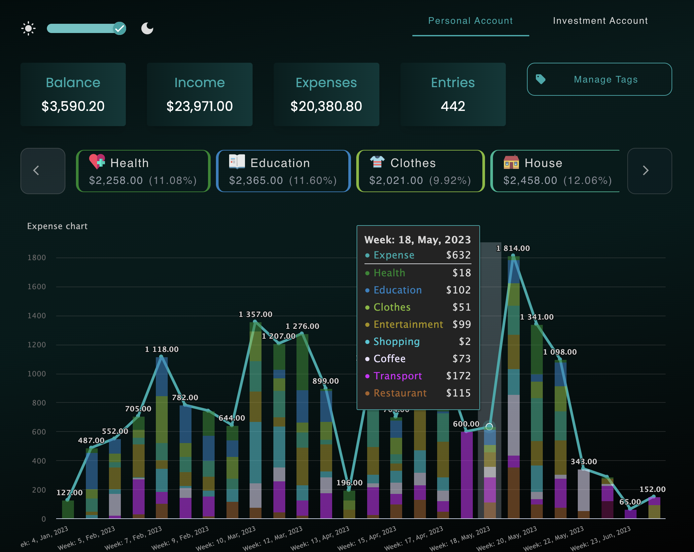
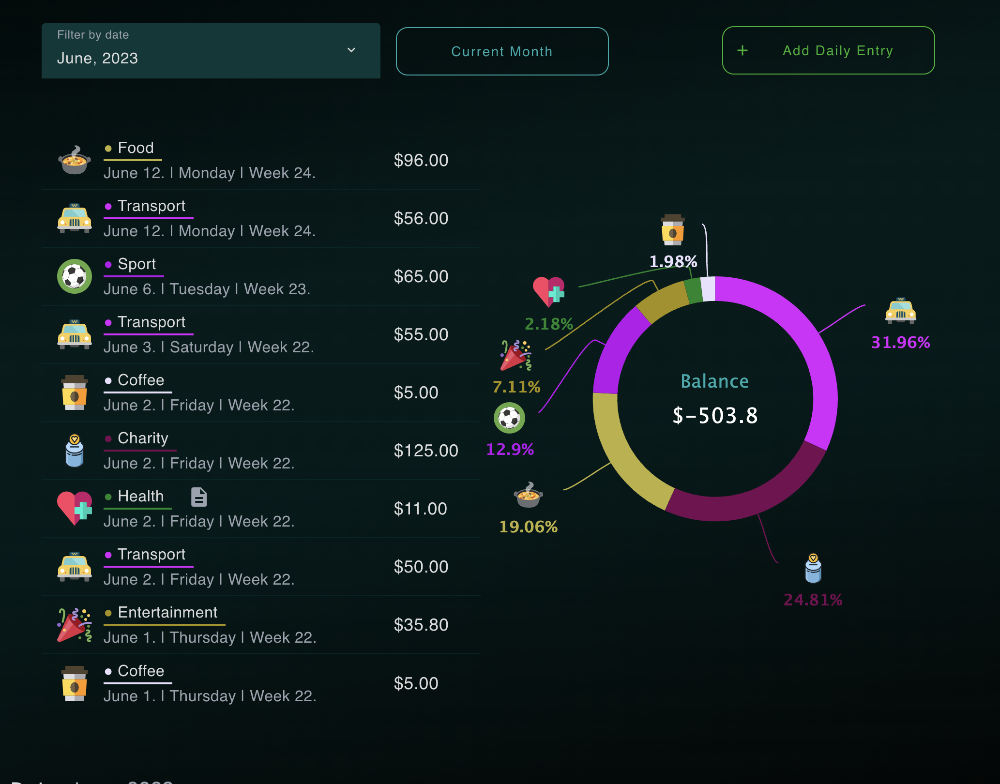
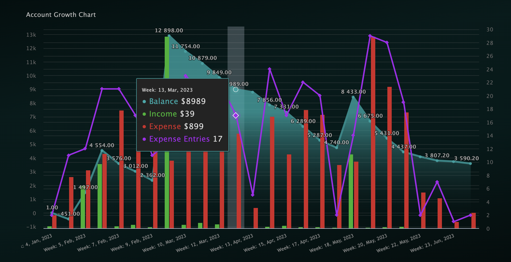
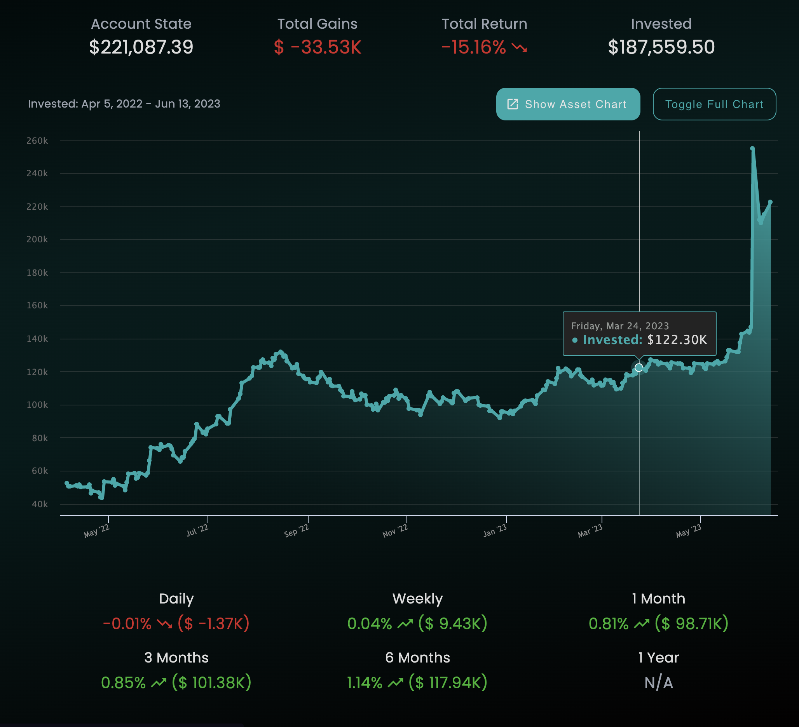
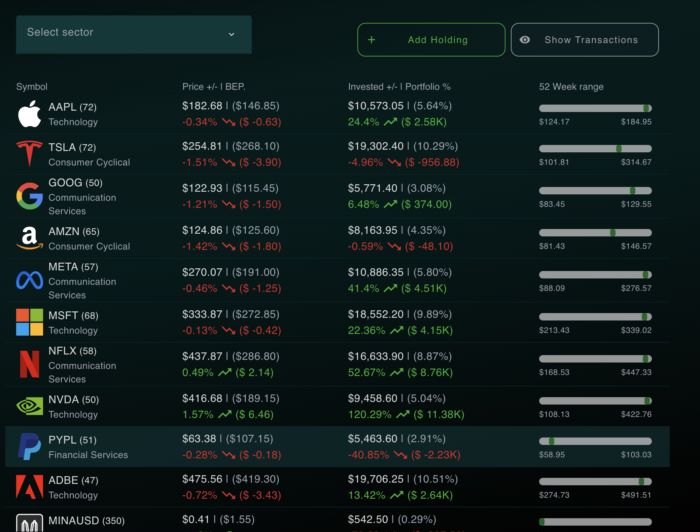

## Overview
The purpose of the application is to have on system for logging personal incomes, expenses and investments. In the desktop version a person can see multiple chart analytics on his spending/investing, however also a mobile version is available. Links are following:
- https://spendmindful.com/
- https://play.google.com/store/apps/details?id=spendmindful.com

## Images

## GCP Deployment
The `client` and the `server` part of the application are deployed into GCP via Dockerfile to the cloud-run service. 
Each folder contains a `cloudbuild.yaml` that takes care of the build.
To deploy the app to GCP, follows these steps:
- See current project:
  - `gcloud config get-value project`
- List all projects:
  - `gcloud projects list`
- Set new project as active:
  - `gcloud config set project XXX`
- Deploy to GCP by:
  - `gcloud builds submit`

## Build for Android 
- Build the app 
  - `ng build`
- Copy new code into native projects
  - `npx cap copy`
  - `npx cap sync android`
  - `npx cap update`
- Open Android studio
  - `npx capacitor open android`
- In `build.gradle` change
  - `versionCode`
  - `versionName`
- Commands
  - Fingerprint Debug: `keytool -list -v -keystore ~/.android/debug.keystore -alias androiddebugkey -storepass android -keypass android`
  - Fingerprint Release: `keytool -keystore ~/Documents/generated_keys/android_signature -list -v`
